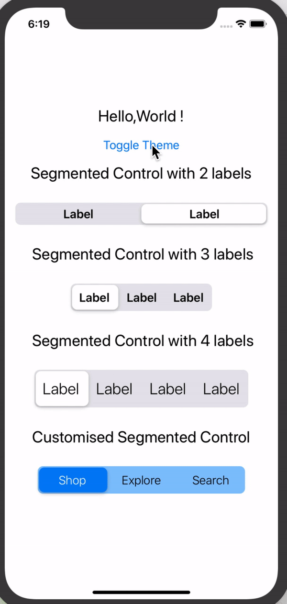
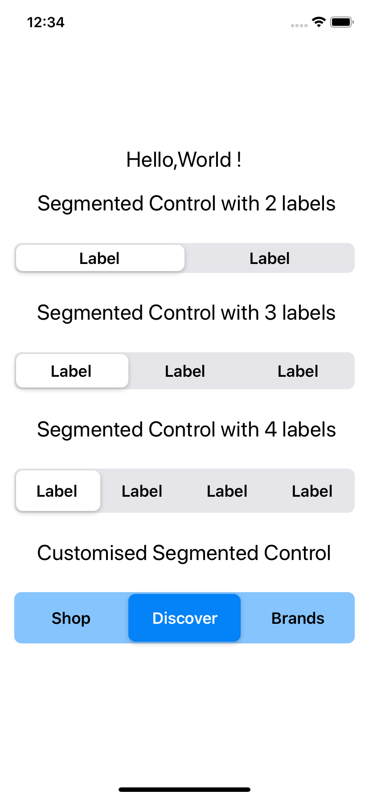
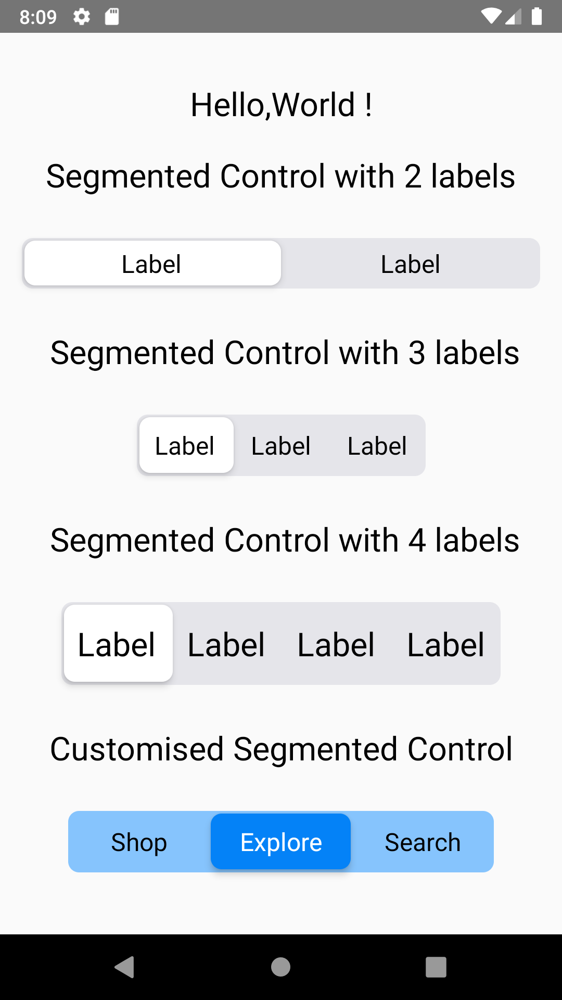
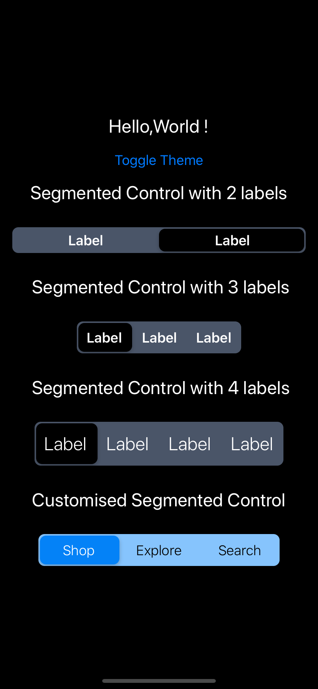

<div align="center">
  
[](https://www.npmjs.com/package/rn-segmented-control) [](https://www.npmjs.com/package/rn-segmented-control) [](https://www.npmjs.com/package/rn-segmented-control) [](https://badgen.net/npm/types/tslib)
  
<h1>React Native Segmented Control</h1>




</div>

---

## :anchor: Installation

```sh
yarn add rn-segmented-control
# or
npm i rn-segmented-control
```

## :arrows_clockwise: Dependencies

```sh
npm i prop-types
```

## :mag: Usage

```js
import React from "react";
import { Dimensions, StyleSheet, Text, View, Button } from "react-native";
import SegmentedControl from "rn-segmented-control";

const AppRoot = () => {
  const [tabIndex, setTabIndex] = React.useState(1);
  const [theme, setTheme] = React.useState("LIGHT");
  const toggleTheme = () =>
    theme === "LIGHT" ? setTheme("DARK") : setTheme("LIGHT");
  const handleTabsChange = (index) => {
    setTabIndex(index);
  };
  return (
    <View
      style={[
        styles.container,
        { backgroundColor: theme === "LIGHT" ? "white" : "black" },
      ]}
    >
      <Text
        style={[
          styles.textStyle,
          { color: theme === "LIGHT" ? "black" : "white" },
        ]}
      >
        Hello,World !
      </Text>
      <Button title="Toggle Theme" onPress={toggleTheme}></Button>
      <Text
        style={[
          styles.textStyle,
          { color: theme === "LIGHT" ? "black" : "white" },
        ]}
      >
        Segmented Control with 2 labels
      </Text>
      {/* Default Segmented Control */}
      <SegmentedControl
        tabs={["Label", "Label"]}
        onChange={() => {}}
        paddingVertical={6}
        containerStyle={{
          marginVertical: 20,
        }}
        currentIndex={tabIndex}
        onChange={handleTabsChange}
        theme={theme}
      />
      <Text
        style={[
          styles.textStyle,
          { color: theme === "LIGHT" ? "black" : "white" },
        ]}
      >
        {" "}
        Segmented Control with 3 labels
      </Text>
      {/* Segmented Control with a custom width */}
      <SegmentedControl
        tabs={["Label", "Label", "Label"]}
        onChange={() => {}}
        paddingVertical={10}
        containerStyle={{
          marginVertical: 20,
        }}
        width={Dimensions.get("screen").width - 200}
        theme={theme}
      />
      <Text
        style={[
          styles.textStyle,
          { color: theme === "LIGHT" ? "black" : "white" },
        ]}
      >
        {" "}
        Segmented Control with 4 labels
      </Text>
      <SegmentedControl
        tabs={["Label", "Label", "Label", "Label"]}
        onChange={() => {}}
        paddingVertical={14}
        width={Dimensions.get("screen").width - 90}
        containerStyle={{
          marginVertical: 20,
        }}
        textStyle={{
          fontWeight: "300",
          fontSize: 24,
        }}
        theme={theme}
      />
      <Text
        style={[
          styles.textStyle,
          { color: theme === "LIGHT" ? "black" : "white" },
        ]}
      >
        Customised Segmented Control
      </Text>
      {/* Segmented Control with a custom width, container style and font weight */}
      <SegmentedControl
        tabs={["Shop", "Explore", "Search"]}
        segmentedControlBackgroundColor="#86c4fD"
        activeSegmentBackgroundColor="#0482f7"
        activeTextColor="white"
        textColor="black"
        paddingVertical={10}
        width={Dimensions.get("screen").width - 100}
        containerStyle={{
          marginVertical: 20,
        }}
        textStyle={{
          fontWeight: "300",
        }}
      />
    </View>
  );
};

const styles = StyleSheet.create({
  container: {
    flex: 1,
    justifyContent: "center",
    alignItems: "center",
    paddingHorizontal: 16,
  },
  textStyle: {
    fontSize: 24,
    textAlign: "center",
    paddingVertical: 10,
  },
});

export default AppRoot;
```

## :camera: Screenshot

| iOS                                                                                            | Android                                                                                            | Dark Mode                                                                                          |
| ---------------------------------------------------------------------------------------------- | -------------------------------------------------------------------------------------------------- | -------------------------------------------------------------------------------------------------- |
|  |  |  |

## :wrench: Props

| Name                            | Description                                    | Required | Type                 | Default               |
| ------------------------------- | ---------------------------------------------- | -------- | -------------------- | --------------------- |
| tabs                            | An array of labels for segments                | YES      | Array                | []                    |
| onChange                        | A callback Function with pressed segment index | YES      | Function             | () => {}              |
| currentIndex                    | Index for the currently active segment         | YES      | Number               | 0                     |
| activeSegmentBackgroundColor    | Background color of Active Label               | NO       | Color                | Set by theme          |
| segmentedControlBackgroundColor | Background color of the segment                | NO       | Color                | Set by theme          |
| textColor                       | Color of Label Text                            | NO       | Color                | Set by theme          |
| activeTextColor                 | Color of Active Label Text                     | NO       | Color                | Set by theme          |
| activeTextWeight                | Weight of Active Label Text                    | NO       | String               | 600                   |
| paddingVertical                 | A numeric value to manually adjust the height. | NO       | Number               | 12                    |
| width                           | Sets the width of the segmented control        | NO       | Number               | Screen Specific Width |
| containerStyle                  | Style object for the Segmented Control         | NO       | ViewPropTypes.style  | {}                    |
| tileStyle                       | Style object for the absolute positioned tile  | NO       | ViewPropTypes.style  | {}                    |
| textStyle                       | Style object for the Labels                    | NO       | Text.style           | {}                    |
| isRTL                           | Controls the toggle animation direction        | NO       | Bool                 | false                 |
| theme                           | App Theme                                      | NO       | oneOf['LIGHT','DARK] | 'LIGHT'               |
| shadowStyle                     | Style for segment background                   | NO       | Object`[1]`          | null                  |

```js
   [1]
   Shadow Style
   PropTypes.shape({
    shadowColor: PropTypes.string,
    shadowOffset: PropTypes.shape({
      width: PropTypes.number,
      height: PropTypes.number,
    }),
    shadowOpacity: PropTypes.number,
    shadowRadius: PropTypes.number,
    elevation: PropTypes.number,
  })
```

> Color accepts all [React Native Colors](https://reactnative.dev/docs/colors#color-representations).

> :warning: `containerStyle` accepts all View styles and does override some default styles provided by the package. Make sure you use it properly :)

> `textStyle` accepts all Text styles and overrides the defaults except the label colors set by props

> :warning: `tileStyle` accepts all View styles and does override some default styles provided by the package. Make sure you use it properly :)

## :tada: Example

Checkout the example [here](https://github.com/Karthik-B-06/rn-segmented-control/tree/master/examples/RNSegmentedControl).

## :notebook: Blog

Have a look at my blog [here](https://medium.com/timeless/react-native-segmented-control-92508dcba97c).

## :snowman: Built with ❤️

- [react-native](https://www.npmjs.com/package/react-native)

## :white_check_mark: Todos

- [ ] Custom Animation Spring Config
- [ ] Add React Native Reanimated library for animations

## :v: Contributing

Pull requests are always welcome! Feel free to open a new GitHub issue for any changes that can be made.

## :man: Author

[Karthik B](https://twitter.com/_iam_karthik)

## :clipboard: License

MIT

---

<div align='center'>
  <h4>   Like this project ?? </h4>
<a href="https://www.buymeacoffee.com/karthik06" target="_blank"></a>
</div>

---
